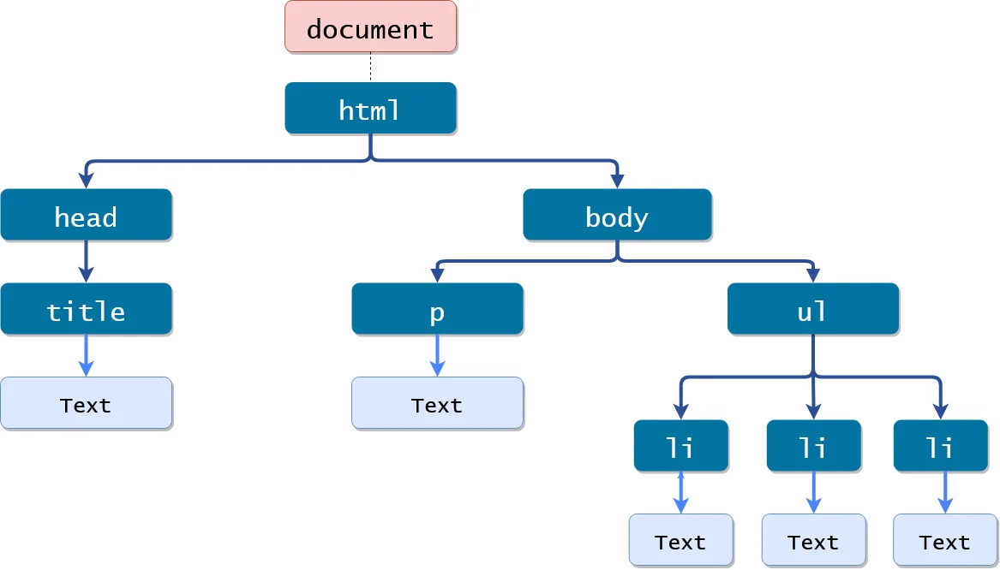
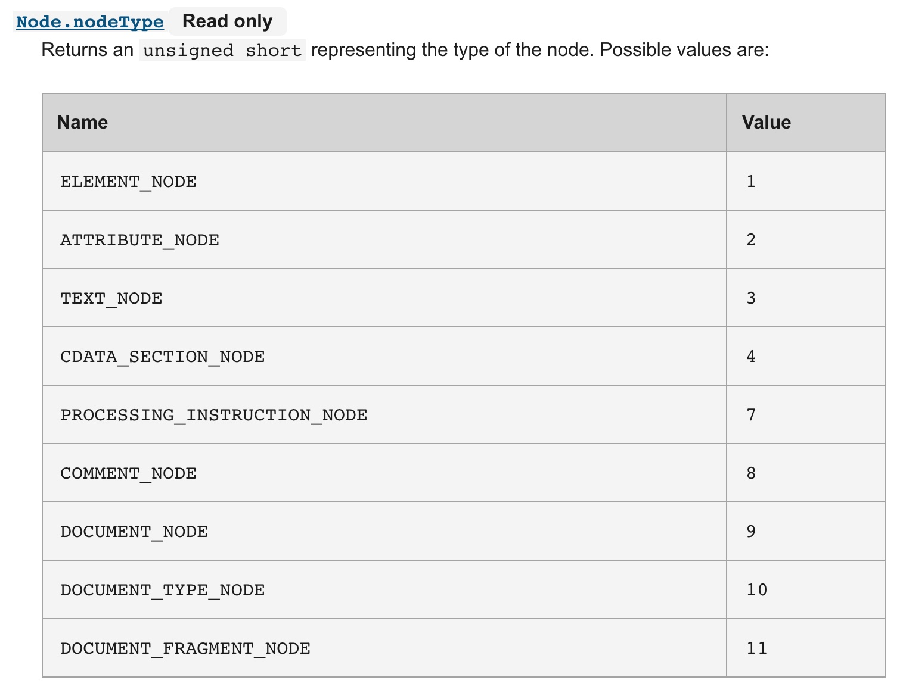

# fritz2 und d3js

In dieesm Projekt wird d3js via Kotlin genutzt. Letztendlich ist d3js eine Biblothek, die es zulässt, den DOM-Baum
via JavaScript zu manipulieren. Damit verfolgen fritz2 und d3js denselben Ansatz, nur dass der Workflow ein 
anderer ist. Die Stärke von fritz2 ist das reaktive Verhalten, die Stärke von d3js ist die Verknüpfung von
Daten mit dem Aussehen von Grafiken. Ziel ist es, diese beiden Stärken zu vereinen, d.h. innerhalb von fritz2
d3js zu nutzen.

# Das HTML-DOM

Weil d3js häufig zwischen `node` und `element` unterscheidet, hier noch einmal der Unterschied.

## Unterschied zwischen Node und Element
Betrachtet man das folgende Dokument,
````html
<!DOCTYPE html>
<html lang="de">
  <head>
    <title>Meine Seite</title>
  </head>
  <body>
    <h2>Meine Seie</h2>
    <p id="inhalt">Danke, dass du meine Website besuchst</p>
  </body>
</html>
````
so werden die Tags in dem HTML-Dokument durch `nodes` repräsentiert. Interessant ist, dass auch "normaler" Text durch 
einen Knoten repräsentiert wird.

Der Text "Meine Seite" ist ein `text-node`.

Damit kommt man dem Unterschied zwischen einem `node` und einem `element` schon fast auf die Schliche. Schaut man sich 
das Inerface `node` der DOM-Spezifikation genauer an, so hat jeder `node` eine node.type-Eigenschaft.
Auf der [mozilla-Seite](https://developer.mozilla.org/en-US/docs/Web/API/Node) ist dies gut dokumentiert.
Hier ein Screenshot der Seite:



Das Element ist also ein spezifischer Node. Als Node bezeichnet man die Teile des HTML-DOMs
die widerum alle einen Typ haben, von denen einer der Typ Element ist.

Als Beispiel zusammengefasst: der Text in einem HTML-Dokument ist ein Node, aber kein Element. Das P-Tag `<P>` dagegen ist ein Node 
und auch ein Element.

# Das Shadow-DOM
Für das Shadow-DOM gibt es die folgende [Seite](./shadowdom.md)

# JavaScript Function-Objects in Kotlin
Im Zusammenhang mit den Verhaltenskomponenten in dem Drag- und Drop-Beispiel gab es das Problem, dass in JavaScript
Objekte mit eigenen Memberfunktionen durch eine Funktion abgebildet werden können. Um den entsprechenden Code in Kotlin
abzubilden habe ich mich schwer getan. Das Thema wird auf der 
[Kotlin-Seite](https://kotlinlang.org/docs/js-interop.html#declare-static-members-of-a-class) behandelt und wird 
in einer eigenen [Datei](./functionObjectsToKotlin.md) beschrieben.


