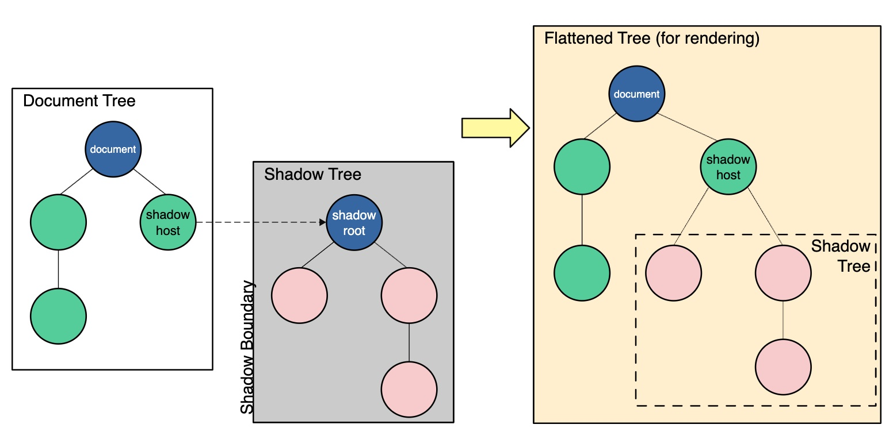

# Das Shadow-Dom
Die folgende Grafik von der <a name='link' href='https://developer.mozilla.org/en-US/docs/Web/Web_Components/Using_shadow_DOM'>mozilla-Seite</a>
beschreibt das Shadow-DOM:

 

Auf der Seite wird der Shadow-Dom insbesondere dazu benutzt, versteckte DOM-Trees in den regulären DOM-Tree einer Seite 
zu setzen. Folgende Begriffe spielen im Zusammenhang mit dem Shadow-DOM eine Rolle:
<ul>
    <li>Shadow host: der reguläre DOM-Node, an den der shadow DOM gehängt wird</li>    
    <li>Shadow tree: der DOM tree innerhalb des shadow DOMs</li>
    <li>Shadow boundary: die Grenze, an der der shadow DOM endet und derreguläre DOM beginnnt</li>
    <li>Shadow root: der root node des shadow Trees.</li>
</ul>

Das shadow-Dom ist nicht neu, so enthält zum Beispiel eine HTML-Seite, auf der ein `<video>`-Element
eingebunden ist einen shadow-DOM für das Video-Element, weil man auf der Seite lediglich das Video-Element
sieht, es aber noch eine Reihe von Buttons etc. zur Steuerung des Videos enthält.

Wie man mit dem shadow-DOM programmiert, zeigt die oben erwähnte [Seite](#link).

